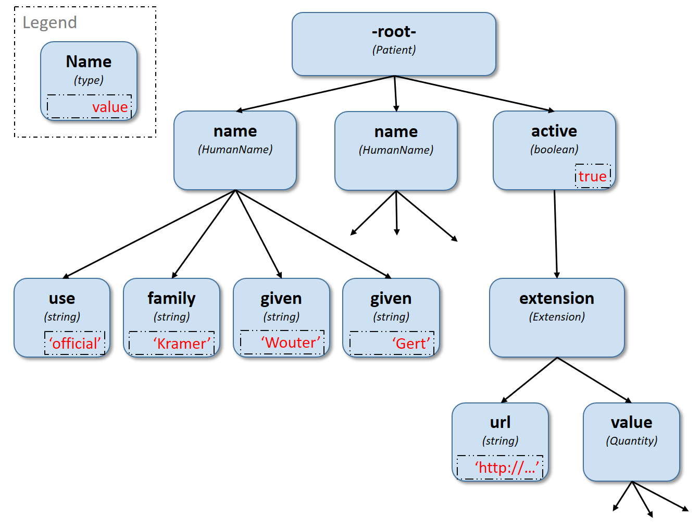

## Recetario

|||
|:-:|:-:|
||[Before a patient can complete a Task, it has to be assigned to them. Recetario is our lightweight app that can be integrated into your EHR, to allow clinicians to quickly and easily select Forms, Surveys, and Questionnaires, and send them to the patient to be completed.](https://recetario-dev-mctbmzb4uq-uk.a.run.app?isMockDemo=true)|

## FHIRPath

|||
|:-:|:-:|
||[FHIRPath is a powerful path based navigation and extraction language that is used to power much of our work, including scoring in Questionnaires. Take a look for yourselves and see how it works.](https://fhir-path-demo-mctbmzb4uq-uk.a.run.app)|
